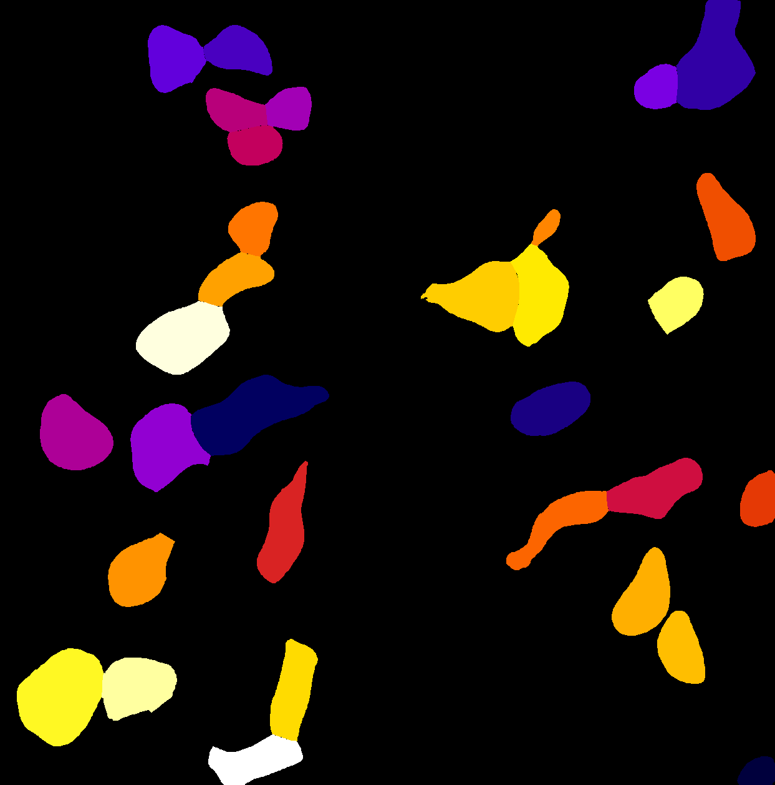
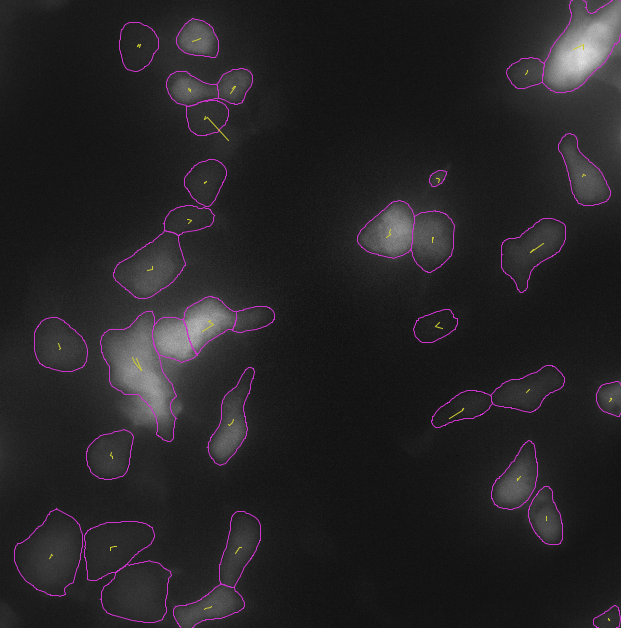

This is a jython code that can be opened with Fiji(image J) to batch process images in defined folders using the TrackMate-CellPose plugin. Inputs are .tif files (time series). Outputs are .tif files after masking and tracking. This code is modified from [this post](https://forum.image.sc/t/script-cellpose-trackmate/66356) and the [TrackMate scripting instruction page](https://imagej.net/plugins/trackmate/scripting/scripting), thanks to the wonderful [Jean-Yves Tinevez](https://forum.image.sc/u/tinevez/summary). 

Before you start, please make sure you have the following installed:

* Fiji(image J): https://imagej.net/software/fiji/
   
   a) TrackMate-CellPose plugin: https://imagej.net/plugins/trackmate/detectors/trackmate-cellpose

* [CellPose](https://github.com/MouseLand/cellpose)

** Optional: you can set up GPU usage following the instructions, although CPU would also work
** Note: keep track of the directory where you install CellPose and where the CellPose models are. You will need to type in these directories in the code

   
## Example files and output

You can find example images in "trackmate-cellpose_test_data\" to play with. Note that these images only have one color channel. However, including an additional nucleus channel would greatly improve masking accuracy based on my experience. 

Example outputs from running the trackmate_cellpose_batch.py are:

1) masked time series (.tif), with each detected cell labeled with a unique integer

   
3) tracked images (.tif)
   
   
## References

[Stringer, Carsen, et al. "Cellpose: a generalist algorithm for cellular segmentation." Nature methods 18.1 (2021): 100-106.](https://www.nature.com/articles/s41592-020-01018-x)

https://imagej.net/plugins/trackmate/scripting/scripting

https://forum.image.sc/t/script-cellpose-trackmate/66356

